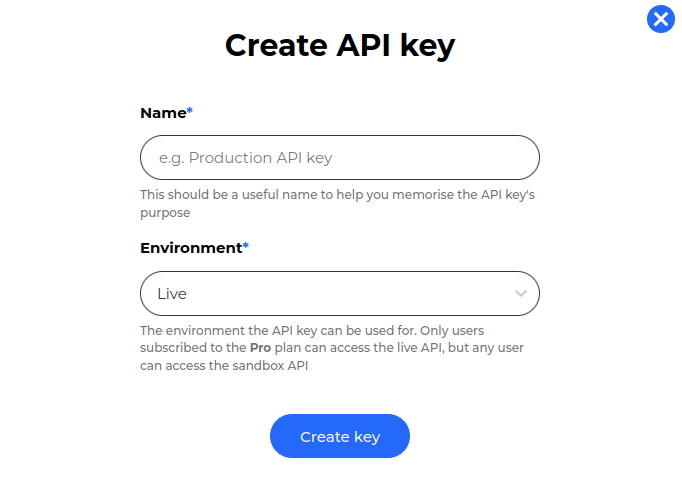
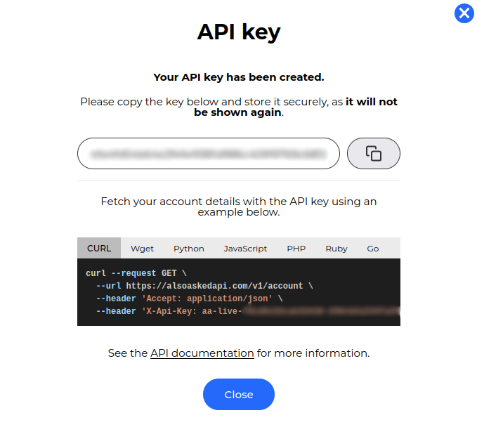

# Authentication

AlsoAsked uses API keys to authenticate requests. You can view and manage your API keys under [Developers -> API keys](https://alsoasked.com/developer/keys).

## API keys

### Creating an API key

To create an API key, click the **Create API key** button. You will be prompted to give your key a name, and specify which environment the key is for. The name is for your reference only and is not used to identify the key anywhere else.

<!--
focus: center
bg: primary
-->


Your API key will be displayed in the modal. You can copy it to your clipboard by clicking the **Copy** button. Save this key somewhere safe, as it will not be displayed again.

Depending on whether your API key is for the **Live** or **Sandbox** environment, it will be prefixed with `aa-live-` or `aa-sandbox-` respectively.

<!--
focus: center
bg: primary
-->


<!-- theme: info -->
> #### Maximum API key count
>
> You can create a maximum of 10 API keys, but can delete and create new ones as needed.
>
> If you believe you need more than 10 API keys, please [contact us](mailto:help@alsoasked.com).

### Authenticating requests

To authenticate a request, you must include your API key in the `X-Api-Key` header.

<!--
type: tab
title: Live
-->

```json http
{
  "method": "GET",
  "url": "https://alsoaskedapi.com/v1/account",
  "headers": {
    "Content-Type": "application/json",
    "X-Api-Key": "aa-live-"
  }
}
```

<!--
type: tab
title: Sandbox
-->

```json http
{
  "method": "GET",
  "url": "https://sandbox.alsoaskedapi.com/v1/account",
  "headers": {
    "Content-Type": "application/json",
    "X-Api-Key": "aa-sandbox-"
  }
}
```

<!-- type: tab-end -->
