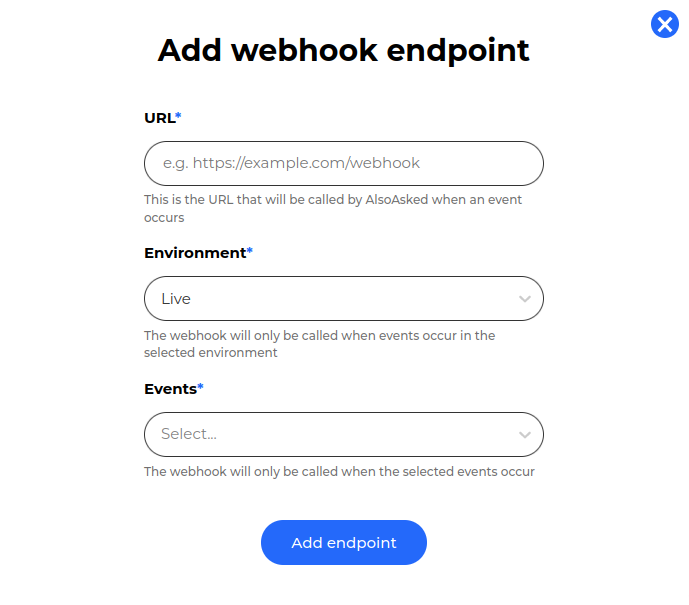
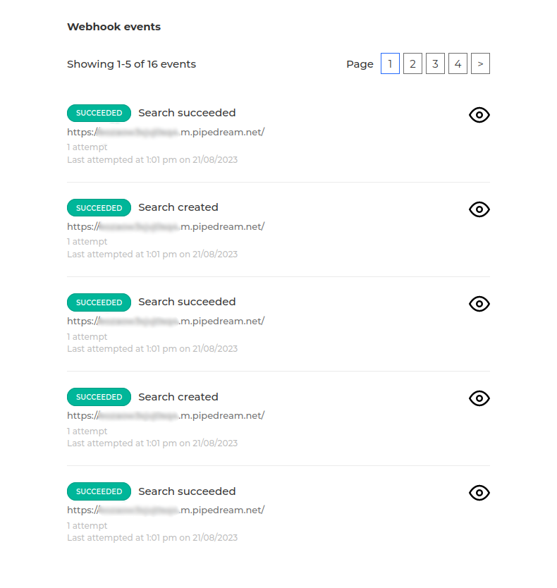
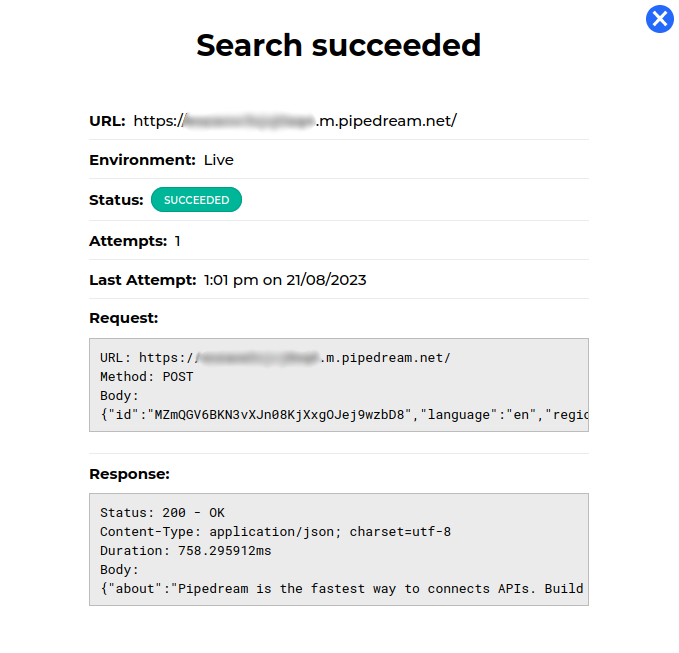
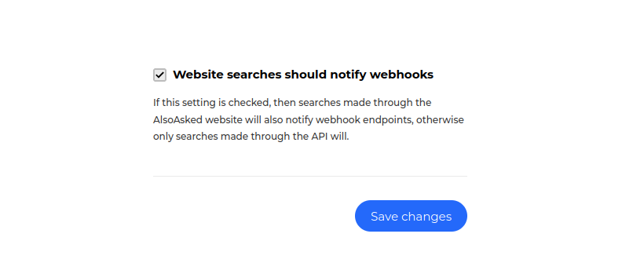
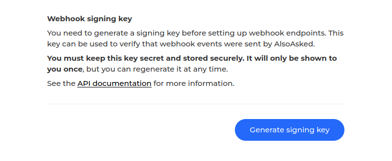
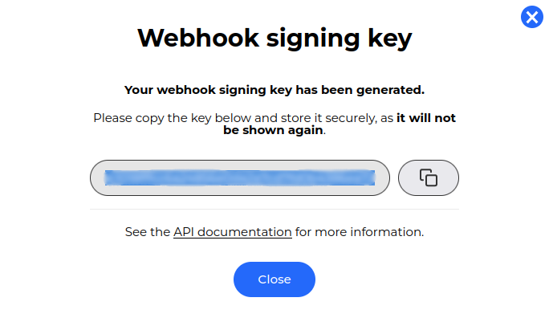
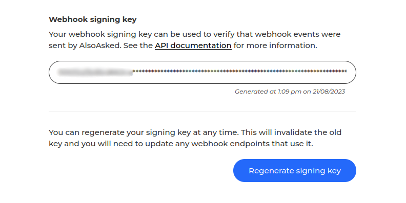

# Webhooks

Webhooks allow you to receive notifications from AlsoAsked when changes occur, such as a search starting or succeeding.

This prevents you from having to continuously poll the search API endpoints to see when the status of a search you've performed has changed, or when results are available.

## Webhook endpoints

You can register webhook endpoints under [Developers -> Webhooks](https://alsoasked.com/developer/webhooks) and clicking the "Add webhook endpoint" button. You'll be asked to generate a webhook signing key if you haven't done so already, this is important for security and we'll cover this further down.



You'll be asked to enter a URL, which we'll make HTTP requests to when the webhook event occurs, the environment which the webhook is for, and the events you'd like to receive notifications for.

<!-- theme: info -->

> #### Maximum webhook endpoint count
>
> You can create a maximum of 5 webhook endpoints, but can delete and create new ones as needed.
>
> If you believe you need more than 5 webhook endpoints, please [contact us](mailto:help@alsoasked.com), but remember that a single webhook endpoint can be used for multiple events.

There are limitations when it comes to the URL you can enter:

- We don't allow requests to be made to localhost, or any IP address
- We also don't allow requests to be made to ports other than 80 and 443
- We currently only support IPv4 addresses, but will support IPv6 in the future
- We don't allow requests to redirect to another URL, so if your domain has redirect rules setup for HTTP to HTTPS, ensure you enter the HTTPS URL

If you need to make requests to a local development environment, you can use a tool like [ngrok](https://ngrok.com/) or [localhost.run](https://localhost.run/) to create a tunnel to your local environment.

## Webhook events

The following webhook events are available:

| **Name**         | **Identifier**   | **Description**                                                             |
|------------------|------------------|-----------------------------------------------------------------------------|
| Search created   | search_created   | A search request has been created and queued to be processed                |
| Search started   | search_started   | A search request has began to be processed, and will either succeed or fail |
| Search succeeded | search_succeeded | A search request has succeeded, and results are available                   |
| Search failed    | search_failed    | After retrying a certain number of times, a search request has failed       |

When we send you a webhook notification, you can use either the `X-AlsoAsked-Webhook-Event` header or the `status` property in the JSON request body to determine which event has occurred.

## Webhook payload

When we send you a webhook notification, we'll send you a JSON payload in the request body, alongside headers to help you determine what the request is for, and if it's a legitimate request.

The following headers are sent with each webhook request:

| **Header**                | **Description**                                                                                                                                                                                      | **Example**                                                                                                               |
|---------------------------|------------------------------------------------------------------------------------------------------------------------------------------------------------------------------------------------------|---------------------------------------------------------------------------------------------------------------------------|
| X-AlsoAsked-Api-Version   | The version of the AlsoAsked API the webhook event originated from.                                                                                                                                  | `X-AlsoAsked-Api-Version: 1.0`                                                                                            |
| X-AlsoAsked-Credits       | The number of credits remaining for your account.                                                                                                                                                    | `X-AlsoAsked-Credits: 984`                                                                                                |
| X-AlsoAsked-Timestamp     | The time which the webhook event was sent in UTC epoch seconds. You can use this alongside the `X-AlsoAsked-Signature` below to prevent replay attacks.                                              | `X-AlsoAsked-Timestamp: 1672531200`                                                                                       |
| X-AlsoAsked-Signature     | A cryptographic hash of the timestamp specified in the `X-AlsoAsked-Timestamp` concatenated with a `.` and the request body. The hash algorithm used is `HMAC-SHA384` with your webhook signing key. | `X-AlsoAsked-Signature: edd3bf9297835c7b02a41e0f4f188a17e9f50c235cc322eddda3780dbd817c932e9c913d2600415a56679a9c4f0cb550` |
| X-AlsoAsked-Webhook-Event | The type of webhook event which triggered the notification.                                                                                                                                          | `X-AlsoAsked-Webhook-Event: search_succeeded`                                                                             |
| X-AlsoAsked-Environment   | The API environment the webhook event originates from.                                                                                                                                               | `X-AlsoAsked-Environment: live`                                                                                           |

The user-agent will be `AlsoAsked/1.0`, although the version suffix may change in the future, and the content type will be `application/json`.

The request body will be a JSON object following the [Search Request Results](https://developers.alsoasked.com/docs/also-asked/f019600cf755a-search-request-results) schema, for example:

```json
{
  "id": "9J1VrsN0ku2E6xW8M5Xh3zylpfZgIcba",
  "depth": 2,
  "cached": true,
  "region": "us",
  "status": "success",
  "deleted": false,
  "queries": [
    {
      "term": "When to plant out broad beans?",
      "results": [
        {
          "results": [
            {
              "results": [
                {
                  "results": [],
                  "question": "Do you get a second crop of broad beans?",
                  "answer_href": "https://www.gardeningknowhow.com/edible/vegetables/broad-bean/growing-broad-beans.htm",
                  "answer_excerpt": "Broad beans are a cool season crop, so they will not produce a second crop. However, you can plant\nbroad beans in the spring and again in the fall.\n",
                  "answer_page_title": "Growing Broad Beans - Gardening Know How"
                },
                {
                  "results": [],
                  "question": "What not to plant with broad beans?",
                  "answer_href": "https://www.gardeningknowhow.com/edible/vegetables/broad-bean/growing-broad-beans.htm",
                  "answer_excerpt": "Broad beans are a cool season crop, so they will not produce a second crop. However, you can plant\nbroad beans in the spring and again in the fall.\n",
                  "answer_page_title": "Growing Broad Beans - Gardening Know How"
                },
                {
                  "results": [],
                  "question": "How to grow broad beans in a greenhouse?",
                  "answer_href": "https://www.gardeningknowhow.com/edible/vegetables/broad-bean/growing-broad-beans.htm",
                  "answer_excerpt": "Broad beans are a cool season crop, so they will not produce a second crop. However, you can plant\nbroad beans in the spring and again in the fall.\n",
                  "answer_page_title": "Growing Broad Beans - Gardening Know How"
                }
              ],
              "question": "When can I transplant broad beans?",
              "answer_href": "https://www.rhs.org.uk/education-learning/gardening-children-schools/family-activities/grow-it/grow/broad-beans\n",
              "answer_excerpt": "Broad beans prefer to be planted in the position where they are to grow, but can be planted in individual\npots during the autumn and transplanted in to the ground in the spring.\n",
              "answer_page_title": "Grow broad beans with children / RHS Gardening"
            },
            {
              "results": [],
              "question": "Do broad beans need to be dried before planting?",
              "answer_href": "https://www.gardeningknowhow.com/edible/vegetables/broad-bean/drying-broad-beans.htm",
              "answer_excerpt": "Next to potatoes, broad beans are one of the easiest staples to grow. Dried broad beans, or fava beans, are\nsimply beans left in the pod until they rattle. When you've had your fill of fresh, leave the rest on the\nplant to dry. If it's wet, haul the pods indoors, to shell and dry somewhere warm.\n",
              "answer_page_title": "Drying Broad Beans - Gardening Know How"
            }
          ],
          "question": "When to plant out broad beans?",
          "answer_href": "https://www.gardenersworld.com/how-to/grow/broad-beans/when-to-plant-out-broad-beans/",
          "answer_excerpt": "Broad beans can be planted out from mid-April to mid-May. If you are growing them in a greenhouse, you can\nplant them out from mid-March.\n",
          "answer_page_title": "When to plant out broad beans? | Broad beans | Grow | Gardeners' World Magazine"
        }
      ],
      "region_fallback": false,
      "language_fallback": false
    }
  ],
  "language": "en",
  "cached_at": "2022-12-31T00:00:00Z",
  "created_at": "2023-01-01T00:00:00Z",
  "updated_at": "2023-01-01T00:00:10Z"
}
```

You can see an example of a webhook request in our [API documentation](https://developers.alsoasked.com/docs/also-asked/c5d1f380b6f63-search-webhook-example).

## Inspecting webhook events

When a webhook event occurs, you can inspect the event under [Developers -> Webhooks](https://alsoasked.com/developer/webhooks) by scrolling down to the "Webhook events" section.



This will display a table of webhook events sorted by most recently sent. You can click the inspect icon  to see more information about the event, including the headers, and the request and response bodies.



## Retry mechanism

If your webhook endpoint returns a status other than `200` or `202`, or the connection times out, we'll retry the request forever every 1 minute until it succeeds.

To prevent a failed event from being retried, you can remove either the webhook endpoint, or the webhook event itself, under [Developers -> Webhooks](https://alsoasked.com/developer/webhooks).

## Website searches

By default, searches made through the [AlsoAsked website](https://alsoasked.com) will not trigger webhook events. This is to prevent you from receiving notifications for searches you didn't make through the API.

If you wish to receive webhook events for searches made through the website, you can enable this under [Developers -> API settings](https://alsoasked.com/developer/settings) by ticking the "Website searches should notify webhooks" option and saving the settings.



## Webhook signing key

When you create a webhook endpoint, you'll be asked to generate a webhook signing key if you haven't done so already. This is used to sign the webhook requests we send you, and is used to prevent replay attacks.



It's very important you save this key somewhere secure and private when it's generated, as it will not be shown again. If you lose the key, you'll need to generate a new one, and update all of your webhook endpoints with the new key.



To generate a replacement signing key, go to [Developers -> Webhooks](https://alsoasked.com/developer/webhooks) and click the "Regenerate signing key" button in the "Webhook signing key" section.



## Webhook security

It's very important to verify that webhook events sent to your endpoints originated from us, we provide a number of ways to do this.

### Webhook signing key

The most secure way to verify that a webhook event originated from us is to use the webhook signing key, which is a cryptographic hash of the timestamp concatenated with the request body, alongside the timestamp we send to prevent replay-attacks.

You can use the `X-AlsoAsked-Timestamp` and `X-AlsoAsked-Signature` headers to verify that the request originated from us, that the request body hasn't been tampered with, and that the request hasn't been replayed.

To do this, you can use the following examples as a reference, which verify that both the signature is valid, and the timestamp is in the last 10 seconds:

<!--
title: "Verify the webhook signature in Python"
lineNumbers: true
-->

```python
import hmac
import hashlib
import time

def verify_signature_and_timestamp(secret, timestamp, body, signature):
    if not is_timestamp_recent(timestamp):
        return False

    payload = timestamp + '.' + body
    computed_hmac = hmac.new(secret.encode(), payload.encode(), hashlib.sha384).hexdigest()
    return hmac.compare_digest(computed_hmac, signature)

def is_timestamp_recent(timestamp):
    current_time = int(time.time())
    return current_time - int(timestamp) <= 10

# Example usage
signature = request.headers.get("X-AlsoAsked-Signature")
timestamp = request.headers.get("X-AlsoAsked-Timestamp")
body = request.data

if verify_signature_and_timestamp('your webhook signing key', timestamp, body, signature):
    print("Request is valid!")
else:
    print("Request is invalid!")
```
<!--
title: "Verify the webhook signature in JavaScript (Node.js)"
lineNumbers: true
-->
```javascript
const crypto = require('crypto');

function verifySignatureAndTimestamp(secret, timestamp, body, signature) {
    if (!isTimestampRecent(timestamp)) {
        return false;
    }

    const payload = timestamp + '.' + body;
    const computedHmac = crypto.createHmac('sha384', secret).update(payload).digest('hex');
    return crypto.timingSafeEqual(Buffer.from(computedHmac), Buffer.from(signature));
}

function isTimestampRecent(timestamp) {
    const currentTime = Math.floor(Date.now() / 1000);
    return currentTime - parseInt(timestamp, 10) <= 10;
}

// Example usage
const signature = request.headers["X-AlsoAsked-Signature"];
const timestamp = request.headers["X-AlsoAsked-Timestamp"];
const body = JSON.stringify(request.body);

if (verifySignatureAndTimestamp('your webhook signing key', timestamp, body, signature)) {
    console.log("Request is valid!");
} else {
    console.log("Request is invalid!");
}
```
<!--
title: "Verify the webhook signature in PHP"
lineNumbers: true
-->
```php
function verifySignatureAndTimestamp($secret, $timestamp, $body, $signature) {
    if (!isTimestampRecent($timestamp)) {
        return false;
    }

    $payload = $timestamp . '.' . $body;
    $computedHmac = hash_hmac('sha384', $payload, $secret);
    return hash_equals($computedHmac, $signature);
}

function isTimestampRecent($timestamp) {
    $currentTime = time();
    return $currentTime - intval($timestamp) <= 10;
}

// Example usage
$signature = $_SERVER["X-AlsoAsked-Signature"];
$timestamp = $_SERVER["X-AlsoAsked-Timestamp"];
$body = file_get_contents('php://input');

if (verifySignatureAndTimestamp('your webhook signing key', $timestamp, $body, $signature)) {
    echo "Request is valid!";
} else {
    echo "Request is invalid!";
}
```
<!--
title: "Verify the webhook signature in PHP using the Laravel framework"
lineNumbers: true
-->
```php
use Illuminate\Http\Request;
use Illuminate\Support\Facades\Hash;

public function verifySignatureAndTimestamp(Request $request)
{
    $secret = 'your_secret_key';
    $signature = $request->header('X-AlsoAsked-Signature');
    $timestamp = $request->header('X-AlsoAsked-Timestamp');
    $body = $request->getContent();

    if (!isTimestampRecent($timestamp)) {
        return response('Timestamp not recent', 401);
    }

    $payload = $timestamp . '.' . $body;
    $computedHmac = hash_hmac('sha384', $payload, $secret);

    if (hash_equals($computedHmac, $signature)) {
        return response('Signature is valid!');
    } else {
        return response('Signature is invalid!', 401);
    }
}

private function isTimestampRecent($timestamp) {
    $currentTime = time();
    return $currentTime - intval($timestamp) <= 10;
}
```
<!--
title: "Verify the webhook signature in Ruby"
lineNumbers: true
-->
```ruby
require 'openssl'

def verify_signature_and_timestamp(secret, timestamp, body, signature)
    return false unless is_timestamp_recent(timestamp)

    payload = timestamp + '.' + body
    computed_hmac = OpenSSL::HMAC.hexdigest('SHA384', secret, payload)
    return ActiveSupport::SecurityUtils.secure_compare(computed_hmac, signature)
end

def is_timestamp_recent(timestamp)
    current_time = Time.now.to_i
    return current_time - timestamp.to_i <= 10
end

# Example usage
signature = request.headers["X-AlsoAsked-Signature"]
timestamp = request.headers["X-AlsoAsked-Timestamp"]
body = request.body.read

if verify_signature_and_timestamp('your webhook signing key', timestamp, body, signature)
    puts "Request is valid!"
else
    puts "Request is invalid!"
end
```
<!--
title: "Verify the webhook signature in Go"
lineNumbers: true
-->
```go
package main

import (
	"crypto/hmac"
	"crypto/sha384"
	"encoding/hex"
	"strconv"
	"time"
)

func verifySignatureAndTimestamp(secret, timestamp, body, signature string) bool {
	if !isTimestampRecent(timestamp) {
		return false
	}

	payload := timestamp + "." + body
	mac := hmac.New(sha384.New, []byte(secret))
	mac.Write([]byte(payload))
	expectedMAC := mac.Sum(nil)
	return hmac.Equal([]byte(signature), []byte(hex.EncodeToString(expectedMAC)))
}

func isTimestampRecent(timestamp string) bool {
	currentTime := time.Now().Unix()
	timestampInt, err := strconv.ParseInt(timestamp, 10, 64)
	if err != nil {
		return false
	}
	return currentTime-timestampInt <= 10
}

func main() {
	signature := request.Header.Get("X-AlsoAsked-Signature")
	timestamp := request.Header.Get("X-AlsoAsked-Timestamp")

	var body []byte
	request.Body.Read(body)

	if verifySignatureAndTimestamp("your webhook signing key", timestamp, string(body), signature) {
		println("Request is valid!")
	} else {
		println("Request is invalid!")
	}
}
```
<!--
title: "Verify the webhook signature in C# (.NET)"
lineNumbers: true
-->
```csharp
using System;
using System.Text;
using System.Security.Cryptography;

public class SignatureVerification
{
    public static bool VerifySignatureAndTimestamp(string secret, string timestamp, string body, string signature)
    {
        if (!IsTimestampRecent(timestamp))
        {
            return false;
        }

        string payload = timestamp + "." + body;
        using (HMACSHA384 hmac = new HMACSHA384(Encoding.UTF8.GetBytes(secret)))
        {
            byte[] computedHash = hmac.ComputeHash(Encoding.UTF8.GetBytes(payload));
            string computedSignature = BitConverter.ToString(computedHash).Replace("-", "").ToLower();
            return string.Equals(computedSignature, signature, StringComparison.OrdinalIgnoreCase);
        }
    }

    public static bool IsTimestampRecent(string timestamp)
    {
        long currentTimestamp = DateTimeOffset.UtcNow.ToUnixTimeSeconds();
        long providedTimestamp;
        if (long.TryParse(timestamp, out providedTimestamp))
        {
            return currentTimestamp - providedTimestamp <= 10;
        }
        return false;
    }

    // Example usage
    public static void Main()
    {
        string signature = "<FROM_HEADER_X-AlsoAsked-Signature>";
        string timestamp = "<FROM_HEADER_X-AlsoAsked-Timestamp>";
        string body = "<REQUEST_BODY>";

        if (VerifySignatureAndTimestamp("your webhook signing key", timestamp, body, signature))
        {
            Console.WriteLine("Request is valid!");
        }
        else
        {
            Console.WriteLine("Request is invalid!");
        }
    }
}
```

### IP addresses

You can also verify that the request originated from us by checking the IP address of the request, which will be one of the following:

```
18.168.235.198
```

<!-- theme: info -->
> #### IP address changes
>
> We aim to keep any IP address listed here static, but in the event that we need to change it, or add new IP addresses, we'll update this documentation and send an email to all users with webhook endpoints.
